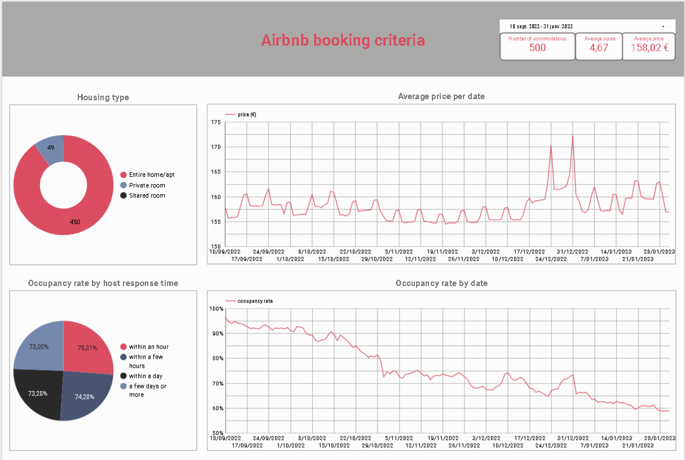
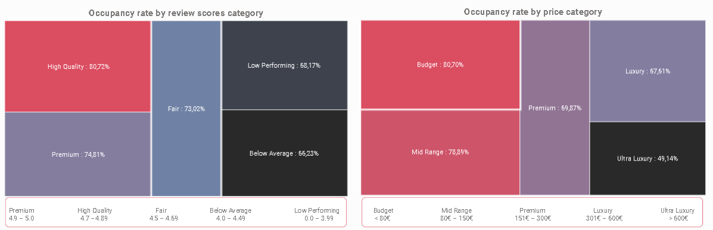
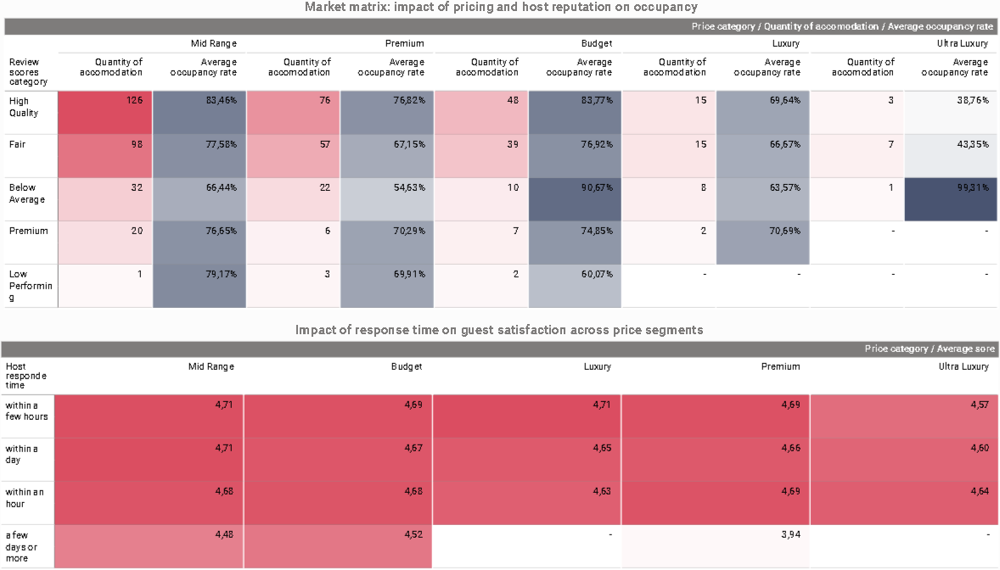

# 🏠 Airbnb data analysis for the city of Paris from 2022-09-09 to 2023-01-31

## 📌 Project overview
Working for the Customer Success team for Airbnb, I have been asked to make an analysis of the Airbnb market in Paris over a 5-month period. 
The purpose of this analysis is to understand the main reasons why some hosts are renting more than others.

## 🛠️ Tech stack
- **Data Source:** Airbnb Data (Paris)
- **Data Warehouse:** Google BigQuery (SQL)
- **Visualization:** Looker Studio
- **Processing:** Python / Pandas (Exploratory Data Analysis)
- **Transformation (ELT):** dbt (Data Build Tool)

## 🔗 Interactive dashboard
You can explore the full interactive report here:
[👉 Airbnb Analysis - Looker Studio Dashboard](https://lookerstudio.google.com/s/qcIcHwPyhPc)

## 📈 Methodology
1. **Exploratory data analysis**
2. **cleaning and modeling of the data:**  medallion architecture (Bronze, Silver, Gold) 
3. **Segmentation:** Created custom SQL fields in BigQuery to categorize listings:
   - **Price segments:** Budget, Mid-Range, Premium, Luxury, Ultra-Luxury.
   - **Review scores:** Premium, High Quality, Fair, Below Average.
4. **Correlation analysis** 

## 🗂️ Repository structure
- `Notebooks/`: Python script for exploratory data analysis (EDA).
- `models/`: dbt models for data transformation (Bronze to Gold layers).
- `Assets/`: Dashboard screenshots.

## 🎯Conclusions

**Travelers favor good value for money without necessarily seeking luxury or the cheapest options**
- The majority of accommodations are in the “High Quality” (rating between 4.7-4.89) / “Mid Range” (price between €80-€150) segment => 126 accommodations with an excellent occupancy rate of 83.44%.

**The rating is more decisive than the price** 
- High Quality accommodations (rating between 4.7 and 4.89) maintain high occupancy rates (>76%) for the most represented price segments (Budget, Mid Range, and Premium). Conversely, occupancy drops dramatically for the “Below Average” category as soon as the price exceeds €80 (Budget segment).

**Responsiveness does not directly influence bookings but does have an impact on satisfaction**
- Occupancy rates are almost identical regardless of response time. However, a late response leads to a drop in rating.

